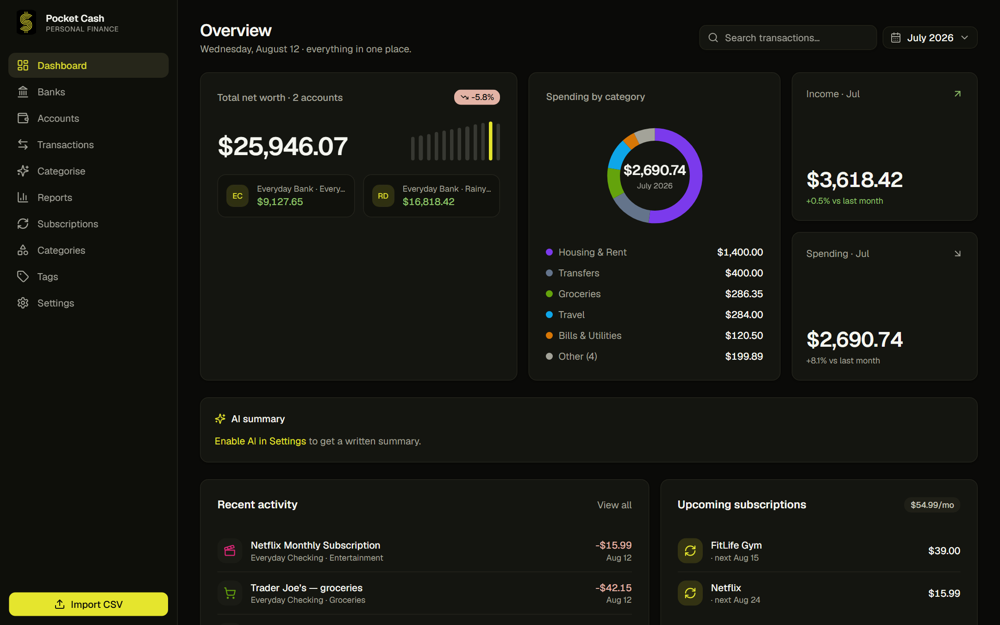
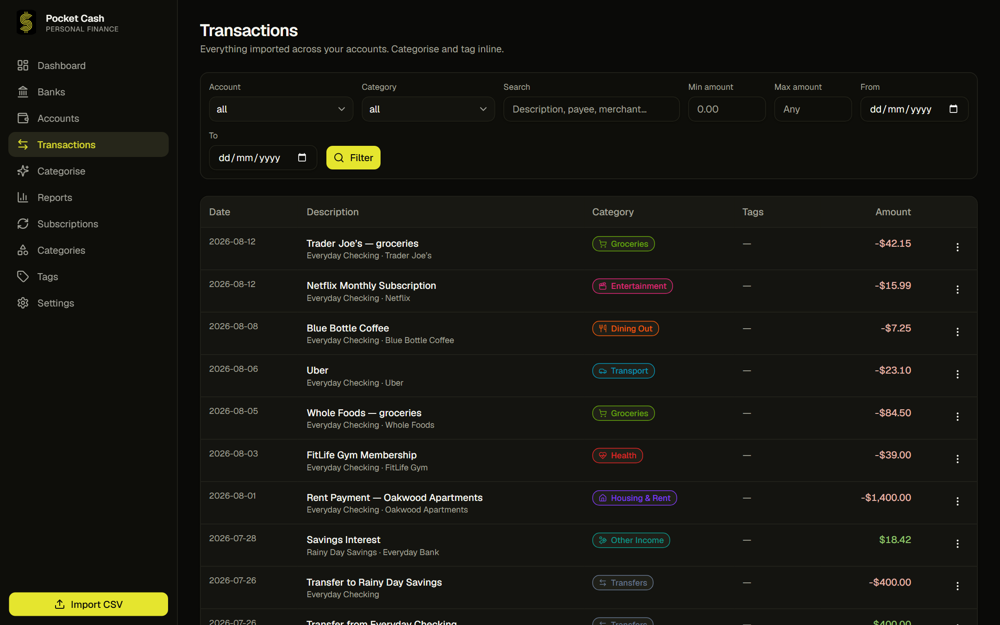
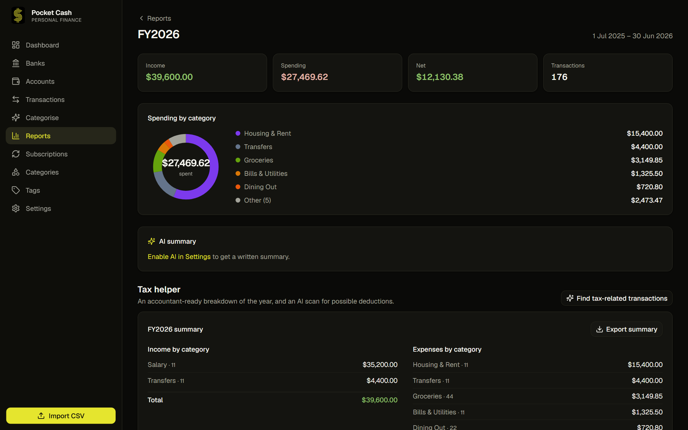
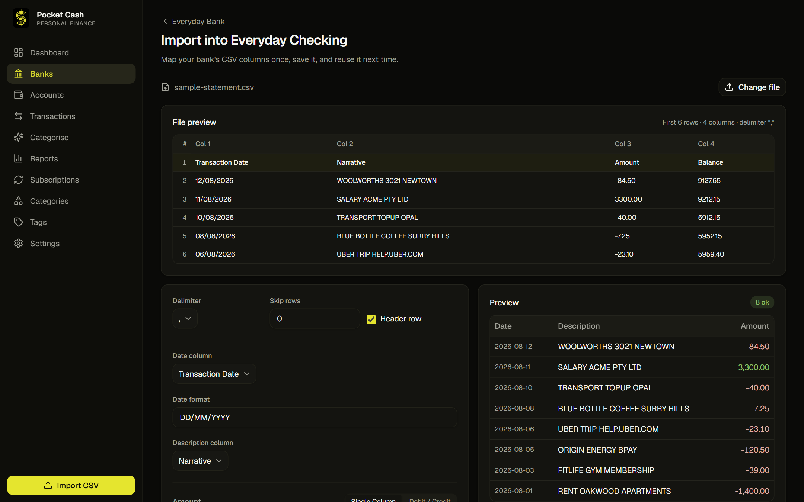

# Pocket Cash

**Finally understand where your money goes.**

Turn messy bank CSV exports into a calm, organised view of your spending — import,
auto-dedupe, categorise, and run financial-year and tax reports. Entirely on your
own machine: no account, no cloud, no telemetry.

[**Download**](https://github.com/tomek-i/pocket-cash-app/releases/latest) ·
[Website](https://tomek.au/pocket-cash-app/) ·
[Docs](./docs) ·
[Changelog](./CHANGELOG.md) ·
[Report an issue](https://github.com/tomek-i/pocket-cash-app/issues)

## Why

- **Your data never leaves your device.** An embedded database inside the app's own
  folder. No sign-in, no servers, no analytics — nothing phones home.
- **Works with any bank.** Anything that exports CSV. Map the columns once and that
  mapping becomes a reusable importer for every future statement.
- **Nothing gets double-counted.** Re-import the same file safely; a per-account
  fingerprint means duplicates are skipped.
- **Built for tax time.** Financial-year summaries, net-worth trends, and a tax
  report with CSV export.
- **AI, only if you want it.** Auto-categorising, insights and a deduction scan —
  off by default, and able to run fully offline against a local model.

## See it in action

| Categorised transactions | Financial-year report | CSV column mapping |
| :----------------------: | :-------------------: | :----------------: |
|  |  |  |

## Download

Grab the latest build from [**Releases**](https://github.com/tomek-i/pocket-cash-app/releases/latest).

| Platform                      | What you get                                                      |
| ----------------------------- | ----------------------------------------------------------------- |
| **Windows 10/11**             | Installer (`PocketCash-Setup-<v>.exe`), a portable `.exe`, or a `.zip` |
| **macOS 11+** (Apple Silicon) | `PocketCash-<v>-mac-arm64.dmg` or a `.zip`                        |

Roughly a 100–120 MB download. There is no Intel Mac or Linux build.

The builds are **unsigned** — there are no paid Microsoft or Apple certificates for
this project — so Windows SmartScreen warns about an unknown publisher, and macOS
needs a [one-time Gatekeeper override](./docs/releasing.md#macos-unsigned-builds-and-gatekeeper)
on first launch.

## Built with

[Next.js](https://nextjs.org) (App Router) · [React](https://react.dev) ·
[Electron](https://electronjs.org) · [PGlite](https://pglite.dev) +
[Drizzle](https://orm.drizzle.team) · [Tailwind](https://tailwindcss.com) ·
[Turborepo](https://turbo.build)

The desktop app is a thin Electron shell that boots the same Next.js server
in-process — web and desktop share one UI and one codebase.

## Documentation

| Doc                                          | What it covers                                                       |
| -------------------------------------------- | -------------------------------------------------------------------- |
| [development.md](./docs/development.md)       | Run it locally, repo layout, scripts, testing, building the installer |
| [architecture.md](./docs/architecture.md)     | How web + Electron share one UI over an embedded database             |
| [releasing.md](./docs/releasing.md)           | How versions and builds are cut, and the macOS Gatekeeper step        |

## License

[PolyForm Noncommercial License 1.0.0](./LICENSE) — free to use, fork, modify and
share for **noncommercial purposes**: personal use, hobby projects, study and
contributions are all welcome. Commercial use is not permitted. This is a
source-available, not an OSI "open source", licence.

Copyright © 2026 Tomek Iwainski.
